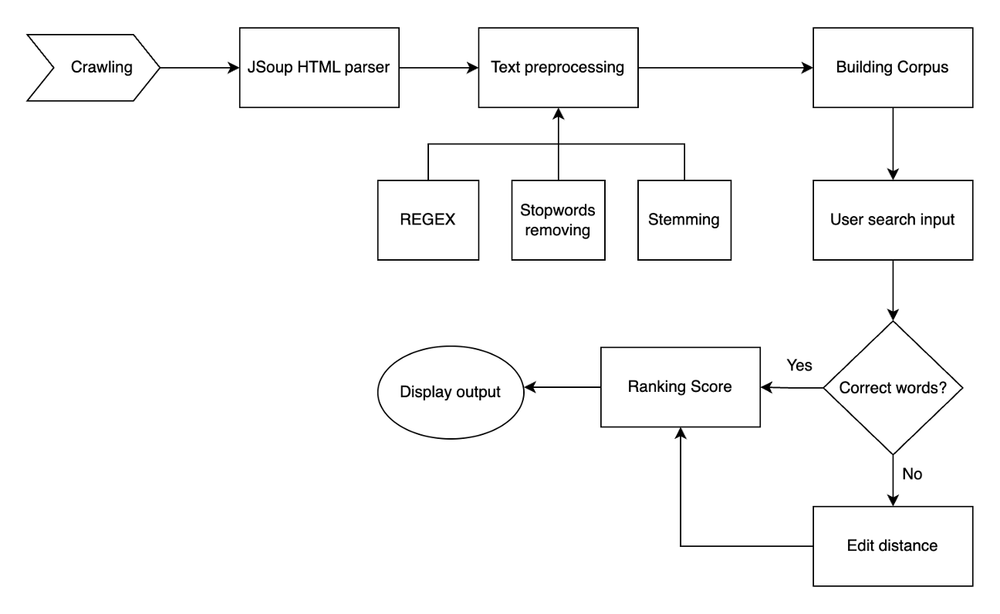

# Simple Search Engine
A simple search engine extracting html with Jsoup, text preprocessing via Stemming, edit distance search, and caching for recent results

# Flow

## Prerequisites

 - [Java](https://www.oracle.com/ca-en/java/technologies/downloads/)